<!--
  Profile README for santhosh292k
  Every card below has a -dark and -light version in ./assets and switches with the viewer's GitHub theme.
  To change a card, edit the text inside its SVG and keep the -dark and -light versions in sync.
-->

<picture>
  <source media="(prefers-color-scheme: dark)" srcset="./dark.svg">
  <source media="(prefers-color-scheme: light)" srcset="./light.svg">
  
</picture>

 

<!-- ───────────────────────── about ───────────────────────── -->
<a href="https://santhosh292k.vercel.app"><picture><source media="(prefers-color-scheme: dark)" srcset="./assets/about-dark.svg"></picture></a>

  

<!-- ───────────────────────── projects ───────────────────────── -->
<picture>
    <source media="(prefers-color-scheme: dark)" srcset="./assets/header-projects-dark.svg">
    
  </picture>

  <a href="https://github.com/Growgle"><picture><source media="(prefers-color-scheme: dark)" srcset="./assets/project-growgle-dark.svg"></picture></a>
  <a href="https://github.com/santhosh292k"><picture><source media="(prefers-color-scheme: dark)" srcset="./assets/project-veritas-dark.svg"></picture></a>

  <a href="https://github.com/Santhosh292K/Federated-Social-Networking-Backend"><picture><source media="(prefers-color-scheme: dark)" srcset="./assets/project-federated-dark.svg"></picture></a>
  <a href="https://github.com/santhosh292k?tab=repositories"><picture><source media="(prefers-color-scheme: dark)" srcset="./assets/project-explore-dark.svg"></picture></a>

  Growgle is live at <a href="https://growgle.vercel.app">growgle.vercel.app</a>

 

<!-- ───────────────────────── experience + education ───────────────────────── -->
<picture>
    <source media="(prefers-color-scheme: dark)" srcset="./assets/timeline-dark.svg">
    
  </picture>

  

<!-- ───────────────────────── stack ───────────────────────── -->
<picture>
    <source media="(prefers-color-scheme: dark)" srcset="./assets/stack-dark.svg">
    
  </picture>

  

<!-- ───────────────────────── achievements ───────────────────────── -->
<picture>
    <source media="(prefers-color-scheme: dark)" srcset="./assets/achievements-dark.svg">
    
  </picture>

  

<!-- ───────────────────────── activity (live cards, served by public APIs) ───────────────────────── -->
<picture>
    <source media="(prefers-color-scheme: dark)" srcset="./assets/header-activity-dark.svg">
    
  </picture>

  <picture>
    <source media="(prefers-color-scheme: dark)" srcset="https://github-readme-stats.vercel.app/api?username=santhosh292k&show_icons=true&include_all_commits=true&hide_border=true&border_radius=16&bg_color=0B1220&title_color=A78BFA&icon_color=22D3EE&text_color=CBD5E1&ring_color=22D3EE">
    
  </picture>
  <picture>
    <source media="(prefers-color-scheme: dark)" srcset="https://streak-stats.demolab.com/?user=santhosh292k&hide_border=true&border_radius=16&background=0B1220&stroke=1E293B&ring=22D3EE&fire=A78BFA&currStreakNum=F8FAFC&sideNums=F8FAFC&currStreakLabel=22D3EE&sideLabels=CBD5E1&dates=94A3B8">
    
  </picture>

  <picture>
    <source media="(prefers-color-scheme: dark)" srcset="https://github-readme-activity-graph.vercel.app/graph?username=santhosh292k&bg_color=0B1220&color=94A3B8&title_color=A78BFA&line=22D3EE&point=A78BFA&area=true&area_color=22D3EE&hide_border=true&radius=16">
    
  </picture>

<!-- Generated daily by .github/workflows/snake.yml into the "output" branch -->

  <picture>
    <source media="(prefers-color-scheme: dark)" srcset="https://raw.githubusercontent.com/santhosh292k/santhosh292k/output/github-snake-dark.svg">
    
  </picture>

 

<!-- ───────────────────────── connect ───────────────────────── -->
<picture>
    <source media="(prefers-color-scheme: dark)" srcset="./assets/header-connect-dark.svg">
    
  </picture>

  <a href="https://santhosh292k.vercel.app"><picture><source media="(prefers-color-scheme: dark)" srcset="./assets/btn-portfolio-dark.svg"></picture></a>
  <a href="https://github.com/santhosh292k"><picture><source media="(prefers-color-scheme: dark)" srcset="./assets/btn-github-dark.svg"></picture></a>
  <a href="mailto:santhosh292k@gmail.com"><picture><source media="(prefers-color-scheme: dark)" srcset="./assets/btn-email-dark.svg"></picture></a>

<picture>
    <source media="(prefers-color-scheme: dark)" srcset="./assets/footer-dark.svg">
    
  </picture>

<b>Plain-text version</b> (mobile, screen readers, search)

 

**Santhosh A S** · Software Engineer · Full-Stack Developer · AI Engineer · India
Open to opportunities: [santhosh292k@gmail.com](mailto:santhosh292k@gmail.com)

**Now:** building an AI Study Companion

**Experience**
- **SDE Intern, [Inquinion](http://inquinion.com)** (Nov 2025 – Apr 2026, remote): built a cross-platform learning app (React Native + FastAPI) for 500+ users; cut average API latency by 30% across AI-driven learning workflows.

**Education**
- B.S. Data Science and Applications, IIT Madras (May 2024 – present)
- B.Tech Computer Science and Engineering, Amrita Vishwa Vidyapeetham, Coimbatore (Aug 2023 – Aug 2027)

**Projects**
- **[Growgle](https://growgle.vercel.app)**: AI career and skills advisor; RAG over a vector DB with Gemini and Gemma, hybrid semantic search, cloud-native ingestion pipeline. ([code](https://github.com/Growgle))
- **Veritas**: multimodal forensic AI; deepfake detector cascade at 99.26% leave-one-generator-out accuracy, 10-stage legal RAG with statute citations, video RAG that flags changed testimony.
- **[Federated Social](https://github.com/Santhosh292K/Federated-Social-Networking-Backend)**: federated social backend with cryptographic signing, Dockerized services and toxic-bert moderation.

**Stack:** Python, TypeScript, JavaScript, Java, C++, C · React.js, Next.js, Vue.js, Tailwind CSS, React Native, Flutter · FastAPI, Node.js, Express.js, Flask · RAG, LangChain, LangGraph, FAISS, Qdrant · PostgreSQL, MySQL, MongoDB, Firebase, SQLite · Docker, Nginx, Linux, Git, Postman

**Achievements:** 1st at Build2Break 2026 (100+ teams), Anokha Techfair 2026 (150+ teams) and DevX Code:Create:Conquer (120+ teams) · finalist at AI-Verse 2026 (top 5 of 200+) and Kriya Ideathon 2025 · also competed in Google GenAI Hackathon, Google Agentic AI Hackathon, Walmart Sparkathon and Smart India Hackathon 2024

**Links:** [portfolio](https://santhosh292k.vercel.app) · [GitHub](https://github.com/santhosh292k) · [email](mailto:santhosh292k@gmail.com)

